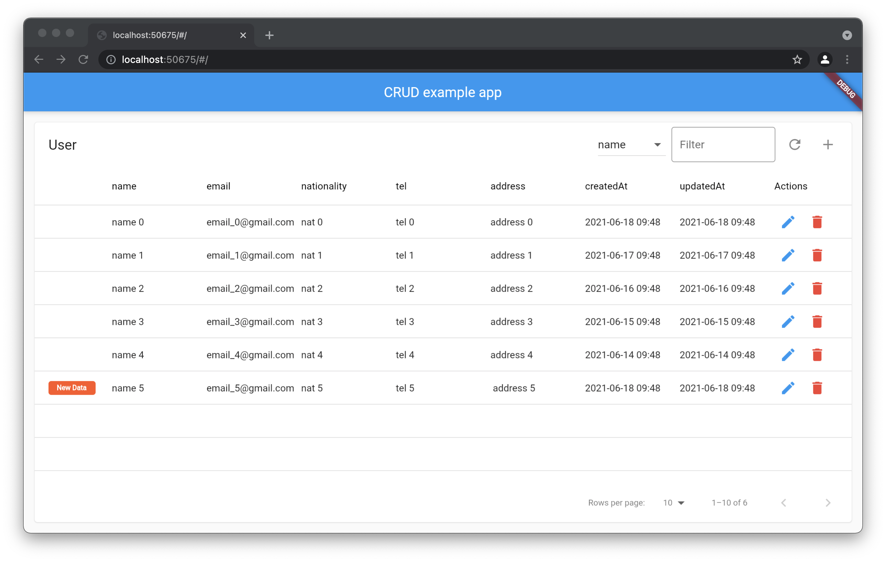

# crud_table

Create fast data tables with CRUD functionality.

<p align="center">
  
</p>

## Installing:

```yaml
dependencies:
   crud_table:
    git:
      url: git://github.com/ZenmovSmoc/crud_table.git
```
```dart
import 'package:crud_table/crud_table.dart';
```

## Basic Usage:
```dart
CRUDTable<UserModel>(
  headerTitle: 'User',
  repository: UserRepository(),
  instance: () => const UserModel(),
  isEditable: true,
  canAddEntry: true,
  customDisplayHandlers: {
    CustomType: (val) {
      final model = val as UserModel;

      return DataCell(
        Center(
          child: ElevatedButton(
            onPressed: () {
              print('tapped ${model.customType!.text}');
            },
            child: Text(model.customType!.text),
          ),
        ),
      );
    },
  }
)
```